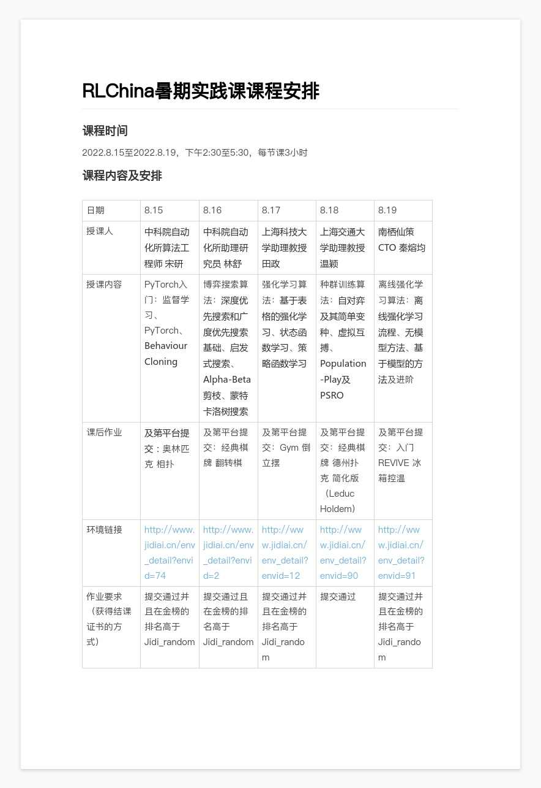

# SummerCourse2022

参与RLChina暑期实践课，一起来学习强化学习吧^0^

小编把每天的课程独立在一个文件夹里面，学习内容递进，完成所有五次作业的学员还将获得电子版结课证书！筒子们冲啊！

课程表👇

详细信息 👉请看 [RLChina官网](http://rlchina.org/)
---
### Env Dependency

#### Install Anaconda or Miniconda

- Anaconda: https://www.anaconda.com/products/distribution
- Miniconda: https://conda.io/projects/conda/en/latest/user-guide/install/index.html

>conda create -n jidi_2022 python=3.7.5

>conda activate jidi_2022

>pip install -r requirements.txt

